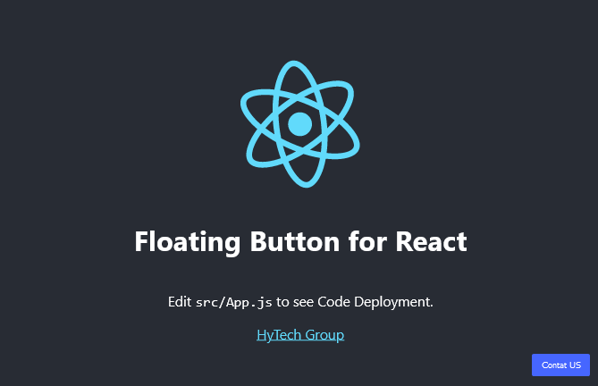

# Floating Button for React

ReactJS modules are simple but have many advantages, one of which is that you can customize them freely.



## Installation
```sh
npm i hytech-component
```

## Example Project Implemented

```sh
// Add - Impport module //
import FloatingButton from 'hytech-component/FloatingButton';
//----//

const App = () => {
  return (
    <div>
    
      // Add - Default components //
	    <FloatingButton position="bottom_left" index="99">
	    	<button>Contat US</button>
	    </FloatingButton>
      //----//
      
    </div>
  );
};

export default App;
```

## Customization

| Atribute | Key | Description |
|:---------|:-----------|:-----------|
|`position="key?` |`top_left` `top_right` `top_center` `bottom_left` `bottom_right` `bottom_center` `middle`| Set Position|
|`index="key?"`|`99` `10`|Set z-index|
|`<button className="theme?">`|`theme-1` `theme-2` `theme-3` `theme-4` `theme-5` `theme-6` `theme-7`|Use Theme & CSS|
|`<Floating className="key?"`|`your-css`|Use Custom CSS|

## Full Customization

```sh
<FloatingButton className="my-css" position="bottom_left" index="99">
    <button className="theme-1">Contat US</button>
</FloatingButton>
```

Official Site: <a href="https://hy-tech.my.id/docs">VISIT</a>

